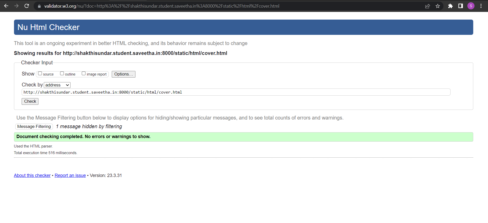

# cover-page-design
## AIM:
To develop a website to display the cover page design of a book

## Design Steps:

### Step 1:
Clone the Github Repository and create a Django admin Interface.
### Step 2:
Write HTML and CSS code for designing book cover page and execute them.
## Code:
``` python
<!DOCTYPE html>
<html lang="en">
    <head>
         <meta name="viewport" 
         content="width=device-width, initial-scale=1.0">
         <style>

        .bookpage{
            width: 500px;
            height: 700px;
            color:black;
            margin-left: auto;
            margin-right: auto;
            padding: 20px;
            font-family: 'Franklin Gothic Medium', 'Arial Narrow', Arial, sans-serif;
            background-image: url(/static/images/bc3.jpg);
            background-size: cover;
        }
            

        .insight{
            color: brown;

        }

        
        .hrstyle{
            width:200px;
        }
        .author{
        
         display: inline;
            position: relative;
            color: red;
            top:300px;
            
            font-family:Georgia;
            font-size: medium;
        }
        .booktitle{
            font-family:Arial, Helvetica, sans-serif;
            font-size: larger;
            text-align: center;
            position: relative;
            
        
        }
        .id {
            width:500px;
            position: relative;
            top:350px;
            
        }
        .pub{
            font-size: medium;
            position: relative;
            top:155px;
            left:330px;
        }
        .ed{
            color:green;
            font-size: medium;
            font-family: Verdana;
            position:relative;
            top:320px;

        }
        .subtitle{
            font-family:Tahoma;
            font-size: large;
            position: relative;
            top:40px;
        }
        .mypic{
            position: relative;
            top: 350px;
            left: 390px;
            width: 100px;
            height: 100px;
            background-size: cover;
        }
        </style>
        <title><br><br>BOOK COVER</title>
    </head>
    <body>
        <div class="bookpage">
            <div class="insight">
              SEC UNIVERSITY
            </div>
            <div class="hrstyle">
                
            </div>
            <div class="booktitle">
                <h1>STOCKS FOR RICHES </h1></div>
            <div class="subtitle">
                MAN TOWARDS FUTURE
            </div>
            <div class="mypic">
                
            </div>
            <div class="id">
                <hr style="color: indigo;">
            </div>
            <div class="author">
               <p><b>SHAKTHI SUNDAR.K</b></p>
            </div>
            <div class="pub">
               
            </div>
            <div class="ed">
                <b>HENDRY Edition</b>
            </div>
        </div>
    </body>
</html>

```

## Output:
### BOOK COVER OUTPUT:

### Validator output:

## Result:
Thus the program to create a book cover design is executed successfully.
